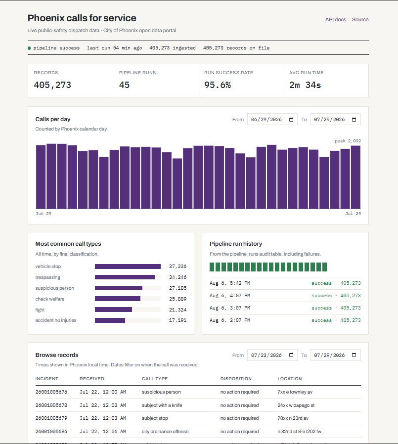

# Phoenix Open Data Pipeline

A service for City of Phoenix public safety dispatch data. It pulls 400,000+ real dispatch records from the city's open data portal on an hourly schedule, upserts them into PostgreSQL in a way that is safe to re-run, and serves them through a public API and a live data explorer.

*Live explorer:* https://dispatch-calls-for-service.up.railway.app/
*API docs:* https://dispatch-calls-for-service.up.railway.app/docs
*Pipeline health:* https://dispatch-calls-for-service.up.railway.app/pipeline/status




## Why this project exists

Government and healthcare systems constantly get and process data from other systems, and certain ways fail without you knowing: a re-run after a crash duplicates every record or a source changes mid-pull and the loop hangs forever. I work as a state certified Direct Care Worker, and I have seen firsthand what it means when an Electronic Visit Verification system loses a session's data with no clear recovery to it

This project applies one conviction to real municipal data: an accepted record must never be lost and never be duplicated. It handles only public, non PII data, so no compliance framework is a legal obligation here. 

## Architecture

```
City of Phoenix open data portal (CKAN, external, no SLA)
        |  datastore_search, paged, polite delay between pages
        v
APScheduler (hourly, in-process, max_instances=1)
        |  httpx fetch -> Pydantic v2 validation -> Phoenix->UTC transform
        v
PostgreSQL 15
        |-- records         INSERT ... ON CONFLICT (natural key) DO UPDATE
        |-- pipeline_runs   one immutable row per run: start, end, count, status, error
        v
FastAPI
        |-- GET /records            date-filtered, paginated, X-Has-More header
        |-- GET /pipeline/status    latest run
        |-- GET /pipeline/runs      recent audit trail
        |-- GET /stats/*            server-side aggregates for the explorer
        |-- GET /                   React + TypeScript explorer (static build)
```

## Guarantees

*Idempotent writes.* Upserts target a named unique constraint on the source's own incident number (`ON CONFLICT ON CONSTRAINT uq_records_natural_key DO UPDATE`).

*Permanent audit trail.* Every run writes a status="running" row committed before work begins, so the fact that a run started survives a crash on the first line, then updates that same row to success or failed with a real error message. Rows are never deleted or overwritten. The live run ledger on the explorer renders this table directly, failures included.

*Bounded ingestion.* The loop has three stacked stopping conditions (empty page, offset reaching a freshly re-read total, and a hard iteration cap)

*Observability.* structlog emits one JSON line per run with counts the system can back (pulled, validated, upserted, failed), correlated to the audit row by a shared run_id.

*Fail-fast configuration.* All config loads through pydantic settings at startup; a missing variable crashes the boot naming the exact field. The first Railway deploy proved this by accident: launched with zero variables, it refused to start and named every missing field in the deploy log.

*Shutdown.* The container runs a single uvicorn worker as PID 1 via exec, and `docker stop` was measured at 0.997 seconds, meaning SIGTERM reaches the app, FastAPI's lifespan shutdown runs, and the scheduler stops cleanly. Railway sends exactly this signal on every redeploy.

## The Day-1 correction

The original plan assumed the portal ran Socrata's SODA API. Verifying against the live portal before writing any code showed it runs CKAN, a different platform with a different API surface. The architecture plan was corrected the same day, including identifying that only resources with `datastore_active=true` can be queried row by row.

## The frontend and why it changed the API

The frontend is React 18 + TypeScript (strict mode) app, built with Vite, hand rolled SVG for the chart, no CSS framework, served as static files by FastAPI so everything is same origin.


Two details worth noting: The daily counts bucket by Phoenix calendar day in SQL (Most of Arizona does not observe DST, and a UTC bucket would shift evening calls into the wrong day's bar). And the explorer's default date ranges depend on the most recent record actually on file, because the city's feed can lag by days.

## Running it locally

Requires Docker, Python 3.11+, and Node 20+.

```bash
git clone https://github.com/northforgebits/dispatch-pipeline
cd dispatch-pipeline
python -m venv .venv && source .venv/bin/activate   # Windows: .venv\Scripts\Activate.ps1
pip install -r requirements-dev.txt
docker-compose up -d                                 # PostgreSQL 15
# create .env with: DATABASE_URL, CKAN_BASE_URL, RESOURCE_ID,
#                   INGEST_LIMIT, INGEST_INTERVAL, MAX_PAGES
alembic upgrade head
uvicorn app.main:app --reload                        # API + scheduler
cd frontend && npm install && npm run dev            # explorer on :5173, proxied to :8000
```

Run the tests the way CI does:

```bash
pytest -q
```

## Testing

17 tests, run in GitHub Actions on every push against a real PostgreSQL 15 service container with Alembic migrations applied before pytest.

## Known limitations

- Each run re-pulls the full dataset rather than fetching incrementally. The idempotent upsert makes this safe, but run duration grows with the dataset. Incremental ingestion is the next planned improvement.
- The batch upsert sends the full batch as one statement. It demonstrably works at 400 thousand+ rows but has no formal ceiling
- The safety cap is a fixed config value (currently 500 thousand rows of headroom). Dataset growth will eventually require raising it
- The HTTP client has no retry logic, so one source error fails that run. The audit trail records it and the next hourly fire recovers, but bounded retries with backoff belong here.

## AI assisted development

The backend pipeline, database layer, tests, CI, and deployment were written by me as a learning project, with the frontend explorer and the four `/stats` endpoints were built with Claude (Anthropic) in a workflow: 

However, there were two real timezone boundary bugs because of this (a date default that rolled to tomorrow every Phoenix evening, and default ranges that went empty when the source feed lagged)

## Data source

City of Phoenix open data portal, Calls for Service dataset (public-safety dispatch records). Public, non PII data; addresses are published by the city at hundred-block granularity.